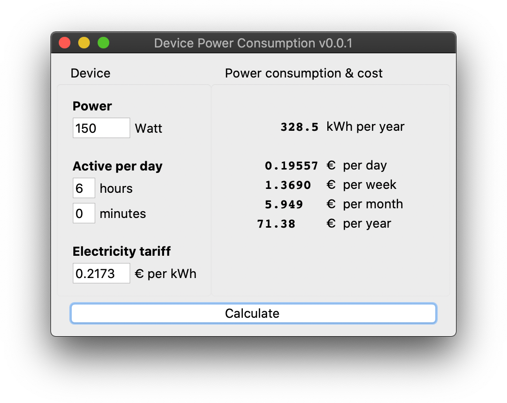

# Device Power Consumption
> Python script to calculate the cost and energy consumption of the use of
an electrical device over a period of time.

Calculate the energy cost of an electrical device based on the power in Watt
and the (average) amount of time it is active during a day (24 hours).
As default this script uses the average electricity tariff from The
Netherlands as was in 2019, of course this value can be modified to
correspondent with your own region or energy supplier.



## Installation

**macOS & Linux:**
Just save the *DevicePower* folder to a location of your choosing.

**Windows:**
This script hasn't been tested on Windows, but should work (?) the same as
with Mac & Linux systems.

## Requirements

* [Python 3.7](https://www.python.org "Python's homepage")

To check which version of Python3 you have (if any), open a terminal and type:

```
python3 -V
```

*(Device Power Consumption was developed using Python 3.7.5 on macOS
Catalina.)*

## Usage

Open a terminal and *cd* to the *DevicePower* directory, then execute the
``device.py`` file with Python:

```
python3 device.py
```

Fill in the power in Watt of an electrical device, then fill in how much time
(on average) it is active during a 24 hour day. Press the *Calculate* button
or ENTER and the script will give you information on the total kWh per year
and the cost over a day, week, month and year.

To get accurate information about the cost you'll need to set the *Electricity
tariff* corresponding to your own region or energy supplier.

## Release History

* 0.0.1
    * Work in progress.

## Meta

tumtidum

Distributed under the GNU GPLv3 license. See ``LICENSE`` for more information.

[https://github.com/tumtidum](https://github.com/tumtidum)
